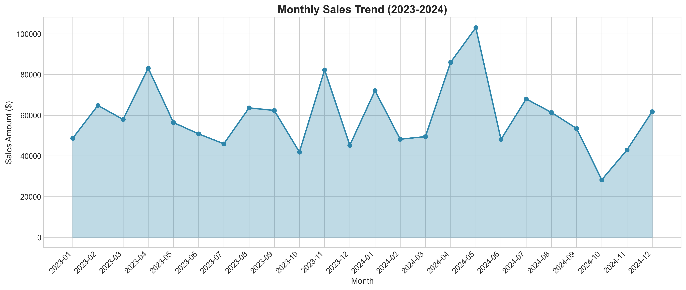

# 🛒 Retail Sales Performance Analysis Dashboard

[](https://python.org)
[](https://pandas.pydata.org)
[](https://scikit-learn.org)
[](https://powerbi.microsoft.com)

A comprehensive retail sales analysis project demonstrating end-to-end data analytics capabilities including data preparation, exploratory data analysis, machine learning, and business intelligence visualization.



---

## 📋 Table of Contents

- [Project Overview](#-project-overview)
- [Dataset](#-dataset)
- [Technologies Used](#-technologies-used)
- [Project Structure](#-project-structure)
- [Key Findings](#-key-findings)
- [Machine Learning Models](#-machine-learning-models)
- [Installation & Setup](#-installation--setup)
- [Usage](#-usage)
- [Power BI Dashboard](#-power-bi-dashboard)
- [Future Improvements](#-future-improvements)

---

## 🎯 Project Overview

This project analyzes retail sales data to uncover actionable insights about:

- **Revenue & Profitability** - Total sales and profit metrics by product and region
- **Customer Behavior** - Purchase patterns and customer segmentation
- **Sales Trends** - Temporal patterns and seasonal analysis
- **Product Performance** - Top performers and category analysis
- **Predictive Analytics** - ML models for sales forecasting


---

## 📊 Dataset

**Source:** Synthetic Superstore-style dataset (1,200 orders)

| Feature | Description |
|---------|-------------|
| **Orders** | 1,200 transactions |
| **Time Period** | 2023-2024 |
| **Total Sales** | $1,425,656 |
| **Total Profit** | $216,875 |
| **Customers** | 100 unique customers |
| **Products** | 40 products across 3 categories |
| **Regions** | 4 (East, West, Central, South) |

### Dataset Columns

```
order_id, order_date, ship_date, ship_mode, customer_id, customer_name,
segment, country, city, state, region, product_id, category, sub_category,
product_name, quantity, unit_price, discount, sales, profit, shipping_cost
```

---

## 🛠️ Technologies Used

| Category | Technologies |
|----------|-------------|
| **Data Analysis** | Python, Pandas, NumPy |
| **Visualization** | Matplotlib, Seaborn |
| **Machine Learning** | Scikit-learn |
| **Business Intelligence** | Power BI Desktop |
| **Development** | Jupyter Notebook, VS Code |

---

## 📁 Project Structure

```
Retail_Sales_Project/
│
├── 1_Raw_Data/
│   ├── generate_sample_data.py     # Dataset generation script
│   └── retail_sales_data.csv       # Raw dataset (1,200 orders)
│
├── 2_Python_Analysis/
│   ├── retail_sales_analysis.py    # EDA & visualization script
│   ├── ml_models.py                # Machine learning models
│   ├── saved_models/               # Trained model files (.pkl)
│   │   ├── sales_predictor.pkl
│   │   ├── customer_segmentor.pkl
│   │   ├── profit_classifier.pkl
│   │   └── scalers.pkl
│   ├── customer_segments.csv       # Customer segmentation results
│   ├── summary_statistics.csv      # Key metrics summary
│   └── *.png                       # Generated visualizations
│
├── 3_Power_BI/
│   ├── cleaned_sales_data.csv      # Cleaned data for Power BI
│   ├── cleaned_sales_data.xlsx     # Excel format for Power BI
│   └── power_bi_guide.md           # Dashboard creation guide
│
├── 4_Documentation/
│   └── key_findings.md             # Analysis insights & recommendations
│
├── venv/                           # Python virtual environment
└── README.md                       # This file
```

---

## 📈 Key Findings

### Executive Summary

| Metric | Value |
|--------|-------|
| **Total Revenue** | $1,425,656.14 |
| **Total Profit** | $216,875.57 |
| **Profit Margin** | 15.21% |
| **Average Order Value** | $1,188.05 |
| **Total Orders** | 1,200 |
| **Unique Customers** | 100 |

### Top Performers

| Category | Best Performer | Value |
|----------|---------------|-------|
| **Region** | East | $387,241 in sales |
| **Category** | Technology | $896,052 (62.9%) |
| **Product** | MacBook Pro 14" | $191,904 |
| **Customer** | Anita Iyer | $46,821 spent |

### Key Insights

1. **Technology dominates sales** (63%) but has lowest margin (11.6%)
2. **Office Supplies** have highest profit margin (30.2%)
3. **East region** leads in both sales and profit
4. **Saturdays** generate highest sales ($240K)
5. **High discounts (>20%)** significantly reduce profitability

---

## 🤖 Machine Learning Models

### Model 1: Sales Prediction
- **Algorithm:** Gradient Boosting Regressor
- **Performance:** R² = 0.9829
- **Use Case:** Forecast sales for inventory planning
- **Top Features:** unit_price, quantity, discount

### Model 2: Customer Segmentation (RFM Analysis)
- **Algorithm:** K-Means Clustering (K=3)
- **Performance:** Silhouette Score = 0.375
- **Segments Identified:**
  - Potential Loyalists (83 customers)
  - Need Attention (17 customers)

### Model 3: Profit Classification
- **Algorithm:** Decision Tree Classifier
- **Performance:** Accuracy = 92.08%
- **Categories:** Loss, Low, Medium, High
- **Key Insight:** Discount is major factor in profit category

---

## ⚙️ Installation & Setup

### Prerequisites
- Python 3.10+
- Power BI Desktop (for dashboard)

### Installation

```bash
# Clone/navigate to project directory
cd "SHG project"

# Create virtual environment
python3 -m venv venv

# Activate virtual environment
source venv/bin/activate  # Linux/Mac
# venv\Scripts\activate   # Windows

# Install dependencies
pip install pandas numpy matplotlib seaborn scikit-learn plotly openpyxl
```

---

## 🚀 Usage

### 1. Generate Sample Data
```bash
source venv/bin/activate
python3 1_Raw_Data/generate_sample_data.py
```

### 2. Run Data Analysis
```bash
python3 2_Python_Analysis/retail_sales_analysis.py
```

### 3. Train ML Models
```bash
python3 2_Python_Analysis/ml_models.py
```

### 4. Create Power BI Dashboard
Follow the step-by-step guide in `3_Power_BI/power_bi_guide.md`

---

## 📊 Power BI Dashboard

The project includes a comprehensive Power BI guide with:

- ✅ DAX measures (15+ formulas)
- ✅ Dashboard layout templates
- ✅ Visual specifications
- ✅ Slicer configurations
- ✅ Design best practices
- ✅ Publication checklist

**Data file:** `3_Power_BI/cleaned_sales_data.xlsx`

---

## 📸 Sample Visualizations

| Visualization | Description |
|---------------|-------------|
| `sales_by_region.png` | Regional sales comparison |
| `sales_by_category.png` | Category distribution pie chart |
| `monthly_sales_trend.png` | 24-month sales trend line |
| `profit_margin_heatmap.png` | Category vs Region heatmap |
| `ml_sales_prediction.png` | Model comparison & predictions |
| `ml_customer_segmentation.png` | RFM clustering results |

---

## 🔮 Future Improvements

- [ ] Add real-time data streaming
- [ ] Implement time series forecasting (ARIMA/Prophet)
- [ ] Create interactive web dashboard (Streamlit/Dash)
- [ ] Add A/B testing analysis module
- [ ] Integrate with SQL database
- [ ] Deploy models as REST API

---

## 👨‍💻 Skills Demonstrated

| Skill Category | Details |
|----------------|---------|
| **Data Wrangling** | Pandas, data cleaning, feature engineering |
| **Visualization** | Matplotlib, Seaborn, 10+ chart types |
| **Machine Learning** | Regression, Classification, Clustering |
| **Business Intelligence** | Power BI, DAX, dashboard design |
| **Python Programming** | OOP, modular code, virtual environments |

---

## 📄 License

This project is for educational and portfolio purposes.

---

## 🤝 Contributing

Feel free to fork this project and submit pull requests for improvements!

---

**Created:** January 2026  
**Last Updated:** January 2026
